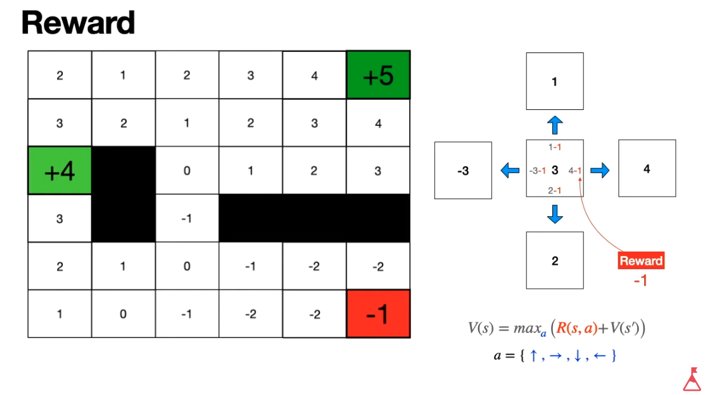

# Reinforcement Learning Notebooks

I made these notebooks following the Udemy course by José Portilla **Practical AI with Python and Reinforcement Learning**:

[https://www.udemy.com/course/practical-ai-with-python-and-reinforcement-learning/](https://www.udemy.com/course/practical-ai-with-python-and-reinforcement-learning/)

In addition to the notebooks in here, this course reviews other introductory concepts not explained here:
- Numpy
- Matplotlib
- Machine Learning concepts
- Pandas
- Scikit-Learn
- Keras: ANNs and CNNs

**Overview**:
1. Introduction and Setup
2. Reinforcement Learning Concepts
3. OpenAI Gym Overview
4. Classical Q-Learning
5. Deep Q-Learning
6. Deep Q-Learning on Images
7. Creating Custom OpenAI Gym Environments

## 1. Introduction and Setup

```bash
conda env list
conda activate tf
pip install jupyter numpy matplotlib gym
# We can also do in a Jupyter notebook: `!pip install gym`
# And we can also install stuff using Anaconda
conda install lxml pandas pillow scikit-learn seaborn tensorflow
```

Introductory sections, not covered here:
- Numpy: `~/Dropbox/Learning/PythonLab/python_manual.txt`
- Matplotlib: `~/Dropbox/Learning/PythonLab/python_manual.txt`
- Machine Learning concepts: `~/Dropbox/Documentation/howtos/sklearn_scipy_sympy_stat_guide.txt`
- Pandas: `~/Dropbox/Learning/PythonLab/python_manual.txt`
- Scikit-Learn: `~/Dropbox/Documentation/howtos/sklearn_scipy_sympy_stat_guide.txt`
- Keras: ANNs and CNNs: 
    - `~/Dropbox/Documentation/howtos/keras_tensorflow_guide.txt`
    - `~/Dropbox/Learning/PythonLab/udemy_cv_course/open_cv_python_manual.txt`

In particular, the guide on Keras collects all important notebook I have on the topic to date:
`~/Dropbox/Documentation/howtos/keras_tensorflow_guide.txt`.

## 2. Reinforcement Learning (RL) Concepts

Where does RL lie in the Machine Learning landscape?
- Supervised learning requires labelled data.
- Unsupervised learning has unlabelled data.
- Reinforcement learning does not use historical data, instead, RL uses rewarded repetition to learn a desired behavior on an environment. In other words: we don't have a dataset, but we act in an environment and see what happens.

Important elements:
- **Agent**: AI that can observe and interact with the environment performing actions; example: robot
    - Observations are often partial.
- **Environment**: the scenario where the game develops with its rules (physical and others); example: maze
    - The environment can change through the actions of the agent.
- **State** vs **Observation**: the state is the complete description of the environment, without hidden data; usually, what we get are observations, though, which are partial views of the state, with hidden or undiscovered pieces of information; note that both are often mixed of used interchangedly.
- **Reward**: we have a goal state in mind, which we would like to achieve. Afte r executing an action, we make observations and estimate the state; depending on how far we are from the goal state (or our improvement towards it, I understand), we assign a better (positive) or worse (negative) reward.
- **Policy**: a set of rules of the AI agent to decide what to do next depending on the observations and the reward. Note that often agent and policy are mixed or used interchangedly.
    - The policy is updated to maximize the reward in the direction of the expected goal state.

Typical example: Cart pole (in Spanish, *péndulo invertido*): The goal is to maintain the cart pole upright by moving the cart left/right; we get an observation of the pole's angle after our moving action and a reward is accordingly assigned depending on its angle.

### Markov Decision Process in a Gridworld and the Bellman Equation

I wrote this section after reading Wikipedia articles and watching the following video:

[A friendly introduction to deep reinforcement learning, Q-networks and policy gradients, by Luis Serrano](https://www.youtube.com/watch?v=SgC6AZss478).

The pictures in this section are taken from that video.

The goal of the section is to explain the Bellman equation, which is probably the most important equation in RL, since it defines how the transitions in the state space are defined so that the goal can be reached.

Let's consider a 6x6 **gridworld** in which an agent can move in 4 directions with one step at a time (i.e., 4 **actions**: up/down & left/right), except when boundaries or obstacles are hit; each possible cell is a **state** and can have a **value** assigned to it.


In that world there are three **terminal states** or cells in which the game ends; we would like to end in the state with the highest value. The process to achieve that is called a **Markov Decision Process**, which consists in executing actions available to the current state that cause transitions to states that are closer to the goal.

The **Bellman equation** is a recursive function which, if called many times, discovers for the complete world
- the **value function** $V()$ that assigns value to any state/cell in the environment
- and the **action policy** $a$ of each cell/state, i.e., the optimum action to take to reach the goal.

Let's say we go from one state to a next with a single action $a$: `s -> s'`; we assume:
- The *value* of each state is given by $V(s)$
- The action $a$ we take is the *optimal* one, i.e., we are trying to maximize the value
- Taking that action has a *reward* (watch out: cost due to action) relative to the state we are in: $R(s,a)$.

Then, the Bellman equation is

$V(s) = \max_{a}\{R(s,a) + \gamma V(s')\}$, where

$gamma$ is a **discount factor** $0 < \gamma < 1$, for instance $\gamma = 0.9$; for simplicity, we can consider it to be $\gamma = 1$.

Following the Bellman equation, we can deduce tha value of a cell/state by observing its neighbors; note that while we go from `s` to `s'` during navigation, for value assigning, we do the oposite: `s' -> s`. Thus, according to the Bellman equation, the value of `s` is the maximum possible value of the next neighbors ($V(s')$) plus the reward ($R(s,a)$), which is negative.



With the Bellman equation we propagate the values of the cells/states from the known ones to the unknowns decreasing with the reward $R(s,a)$ at each step, as if it were a *distance field*.
Note that if we start propagating from different terminal states, inconsistencies might appear in the distance field; however, if we continuously re-run the Bellman equation in the map, the values will converge to a consistent function.
The best policy will be then to take the action that leads to the neighbor cell with the largest value.
Note that **the Bellman equation is usually solved by randomly visiting states/cells: if neighbor values are known, the value of the visited cell/state is updated, until enough states are known and converge**.
That is so because the state space might be very large to sweep and propagate all values.


The discount factor models tha fact that a state value in future steps will loose its value (because we are less sure); in our case, it can be considered $\gamma = 1$ for simplicity.

### Deterministic vs. Stochastic Policies

A **deterministic policy** maps a state to an action.

$a \leftarrow \mu(s)$

A **stochastic policy** assigns probabilities to the set of possible action available for the state; that way, we choose the one with the highest probability, but we are open to take other actions, too!

$\pi(a_i|s)$: $\pi(a_1|s)$, $\pi(a_2|s)$, $\pi(a_2|s)$, $\pi(a_4|s)$

That is also known as **exploitation** (one deterministic action) vs **exploration** (a set of possible actions to try).


### Neural Netowks for Value & Policy Prediction

Since computing the **state values** $V(s)$ and the **action policies** (i.e., which actions to take in each state) might be very expensive for large worlds, one can train neural networks that predict them given past history; that is the key idea behind Deep Reinforcement Learning.

**Value networks** get the coordinates $(x,y)$ of a state/cell $s$ and output its value $V(s)$. The underlying assumption is that close states will have close values. They are trained wandering the environment and forcing the network to yield values compliant with the Bellman equation. This works in practice a s follows:
- We select a cell/state $s$
- We predict with the network its value and the value of its neighbors
- We compute the value of the cell according to the Bellman equation
- We have now a datapoint: the coordinates and the Bellman value
- We compute the error as the difference between the initial guessed value and the Bellman value with the neighbor values
- We apply backpropagation
- If these steps are repeated enough times, the state value predictions converge!

**Policy networks** get the coordinates $(x,y)$ of a state/cell $s$ and output the probability for each of the possible actions $\pi(a_i|s)$, in other words, the stochastic policy. The underlying assumption is that close states will have close policies. They are trained wandering the environment. They are trained as follows:
- We get a path from the network: we predict the policies for the cells and follow the path with the highest probability until we end in a terminal cell.
- We assign **gain** values to each cell backwards starting from the terminal cell: gains are assigned according to Bellman, that is, we basically decrease the final cell value at each step backwards with the reward.
- Our sample datapoints consist of: coordinates, action taken and gain.
- Since we achieved the target, we force the network to increase the action probabilities that yielded it, but with a trick: The gain is multiplied to the weight update during network optimization. That way, only high gains are really reinforced.

## 3. OpenAI Overview

### Brief History of OpenAI

2015: Elon Musk and Sam Altman announced the formation of OpenAI.
Sam Altman is the current CEO.
It started as a non-profit: benefits for humanity sought, goal of reducing the risk of potential harm by AI. They were concerned by AI algorithms being researched only on private companies.

OpenAI Gym is the library they published in 2016: it can be used to set up environments for reinforcement learning.

2018: GPT is published by OpenAI: Generative Pre-Trained algorithm able to produce meaningful/conversational text taking into account the context; the model was trained with a large corpus of data (e.g., the Wikipedia).

2018: Dactyl: a shadow hand trained only in simulations; the robotic hand was able to manipulate a cube after learning everything in the simulation.

2018: Musk left the OpenAI board due to the fact that Tesla was developing also AI algorithms.

2019: OpenAI becomes for-profit, but with a profit cap (100x).

June 2019: GPT-2 is announced, but no code/model provided - the reason according to OpenAI: because bad actors could misuse their model to produce fake new or related; they were criticised for that. Later in Vovember 2019 the model was completely published. It is huge: 1.5 billion parameters.

2020: GPT-3 is announced: 175 billion parameters, the largest language model ever created; Microsoft has the exclusive license.

2021: DALL-E paper is published by OpenAI: very nice Text-to image model. The model is not public.

### OpenAI Gym Documentation

