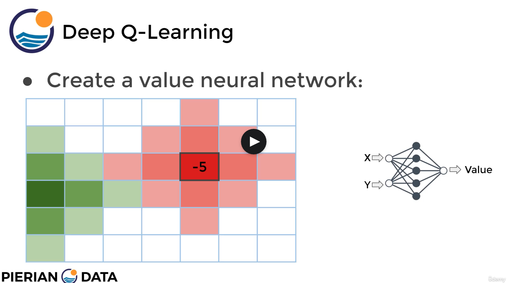
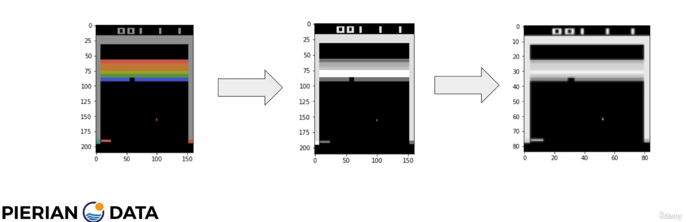

# Reinforcement Learning: Notebooks

I made these notebooks following the Udemy course by José Portilla **Practical AI with Python and Reinforcement Learning**:

[https://www.udemy.com/course/practical-ai-with-python-and-reinforcement-learning/](https://www.udemy.com/course/practical-ai-with-python-and-reinforcement-learning/)

In addition to the notebooks in here, this course reviews other introductory concepts not explained here:
- Numpy
- Matplotlib
- Machine Learning concepts
- Pandas
- Scikit-Learn
- Keras: ANNs and CNNs

**Overview**:
1. Introduction and Setup
2. Reinforcement Learning Concepts
   - 2.1 Markov Decision Process in a Gridworld and the Bellman Equation
   - 2.2 Deterministic vs. Stochastic Policies
   - 2.3 Neural Netowks for Value & Policy Prediction
3. OpenAI Gym Overview
   - 3.1 OpenAI Gym Documentation
   - 3.2 Gym Environments: Overview - `01_OpenAI_Gym_Overview.ipynb`
     - 3.2.1 Atari Breakout Game
     - 3.2.2 Mountain Car
4. (Classical) Q-Learning
   - 4.1 Intuition
   - 4.2 Q Function
   - 4.3 Computing the Q Function and the Q-Learning Table
   - 4.4 Continuous Environments
   - 4.5 Implementation Notebooks
     - `02_1_QLearning_Discrete_FrozenLake.ipynb`
     - `02_2_QLearning_Continuous_Cartpole.ipynb`
     - `02_3_QLearning_Continuous_MountainCar.ipynb`
   - 4.6 Final Remarks
5. Deep Q-Learning (DQN)
   - 5.1 History of DQN
   - 5.2 Review of RL Concepts
   - 5.3 Core Idea of DQN: Overcome the shortcoming of Q-Learning
   - 5.4 Experience Replay / Replay Buffer
   - 5.5 Q Network & Target Network
   - 5.6 Implementation Examples
     - `03_1_DQN_Manual_Cartpole.ipynb`
     - `03_2_DQN_KerasRL2_Cartpole.ipynb`
     - `03_3_DQN_KerasRL2_Acrobot.ipynb`
6. Deep Q-Learning on Images
   - 6.1 DQN Nature Paper: My notes (TBD)
   - 6.2 Processing Images
     - 6.2.1 Color & Scale
     - 6.2.2 Motion
   - 6.3 DQN Agent Implementation Examples
     - `04_1_DQN_Images_Processinng_Images.ipynb`
     - `04_2_DQN_Images_Keras_RL2_Breakout.ipynb`
     - `04_3_DQN_Images_Keras_RL2_Pong.ipynb`
7. Creating Custom OpenAI Gym Environments
   - 7.1 Overview of the Class Structure Required by OpenAI Gym
   - 7.2 Creating a simple snake game with `pygame` (independently from OpenAI Gym): `05_1_DQN_CustomEnvironments_Snake_Pygame.ipynb`
   - 7.3. Converting/Refactoring our custom game to an OpenAI Gym environment
     - Installing the Environment
     - Checking our installed environment: `05_2_DQN_CustomEnvironments_Snake_Gym_Env.ipynb`
   - 7.4. Creating an AI agent to learn on the custom environment: `05_3_DQN_CustomEnvironments_Snake_Training_Agent.ipynb`


## 1. Introduction and Setup

Apple M1:

```bash
conda env list
# conda create -n tf tensorflow
# Watch out: currently (2022-01-24) only TF 2.0 supported on Apple M1?
conda activate tf
conda install jupyter jupyterlab numpy pandas scikit-learn matplotlib seaborn pip -y
# Install OpenAI Gym base library
pip install gym
# By default, only the classic control family is installed
# We need to install specific environment families manually
# Note that I had issues installing Box2D and MuJoCo
pip install "gym[atari,accept-rom-license]"
pip install pygame
pip install pyglet
# We can also do in a Jupyter notebook: `!pip install gym`
# Watch out: no keras-rl2 support for TF < 2.1
# PIL / Pillow
pip install pillow
```

Windows PC:
```bash
conda env list
# conda create -n tf tensorflow
conda activate tf
conda install jupyter jupyterlab numpy pandas scikit-learn matplotlib seaborn pip -y
pip install tensorflow==2.6.2
pip3 install gym
pip install "gym[atari,accept-rom-license]"
pip install pygame
pip install pyglet
pip install keras-rl2
    # Watch out: repository is archived
```


Introductory sections, not covered here:
- Numpy: `~/Dropbox/Learning/PythonLab/python_manual.txt`
- Matplotlib: `~/Dropbox/Learning/PythonLab/python_manual.txt`
- Machine Learning concepts: `~/Dropbox/Documentation/howtos/sklearn_scipy_sympy_stat_guide.txt`
- Pandas: `~/Dropbox/Learning/PythonLab/python_manual.txt`
- Scikit-Learn: `~/Dropbox/Documentation/howtos/sklearn_scipy_sympy_stat_guide.txt`
- Keras: ANNs and CNNs: 
    - `~/Dropbox/Documentation/howtos/keras_tensorflow_guide.txt`
    - `~/Dropbox/Learning/PythonLab/udemy_cv_course/open_cv_python_manual.txt`

In particular, the guide on Keras collects all important notebook I have on the topic to date:
`~/Dropbox/Documentation/howtos/keras_tensorflow_guide.txt`.

## 2. Reinforcement Learning (RL) Concepts

Where does RL lie in the Machine Learning landscape?
- Supervised learning requires labelled data.
- Unsupervised learning has unlabelled data.
- Reinforcement learning does not use historical data, instead, RL uses rewarded repetition to learn a desired behavior on an environment. In other words: we don't have a dataset, but we act in an environment and see what happens.

Important elements:
- **Agent**: AI that can observe and interact with the environment performing actions; example: robot
    - Observations are often partial.
- **Environment**: the scenario where the game develops with its rules (physical and others); example: maze
    - The environment can change through the actions of the agent.
- **State** vs **Observation**: the state is the complete description of the environment, without hidden data; usually, what we get are observations, though, which are partial views of the state, with hidden or undiscovered pieces of information; note that both are often mixed of used interchangedly.
- **Reward**: we have a goal state in mind, which we would like to achieve. Afte r executing an action, we make observations and estimate the state; depending on how far we are from the goal state (or our improvement towards it, I understand), we assign a better (positive) or worse (negative) reward.
- **Policy**: a set of rules of the AI agent to decide what to do next depending on the observations and the reward. Note that often agent and policy are mixed or used interchangedly.
    - The policy is updated to maximize the reward in the direction of the expected goal state.

Typical example: Cart pole (in Spanish, *péndulo invertido*): The goal is to maintain the cart pole upright by moving the cart left/right; we get an observation of the pole's angle after our moving action and a reward is accordingly assigned depending on its angle.

### 2.1 Markov Decision Process in a Gridworld and the Bellman Equation

I wrote this section after reading Wikipedia articles and watching the following video:

[A friendly introduction to deep reinforcement learning, Q-networks and policy gradients, by Luis Serrano](https://www.youtube.com/watch?v=SgC6AZss478).

The pictures in this section are taken from that video.

The goal of the section is to explain the Bellman equation, which is probably the most important equation in RL, since it defines how the transitions in the state space are defined so that the goal can be reached.

Let's consider a 6x6 **gridworld** in which an agent can move in 4 directions with one step at a time (i.e., 4 **actions**: up/down & left/right), except when boundaries or obstacles are hit; each possible cell is a **state** and can have a **value** assigned to it.


In that world there are three **terminal states** or cells in which the game ends; we would like to end in the state with the highest value. The process to achieve that is called a **Markov Decision Process**, which consists in executing actions available to the current state that cause transitions to states that are closer to the goal.

The **Bellman equation** is a recursive function which, if called many times, discovers for the complete world
- the **value function** $V()$ that assigns value to any state/cell in the environment
- and the **action policy** $a$ of each cell/state, i.e., the optimum action to take to reach the goal.

Let's say we go from one state to a next with a single action $a$: `s -> s'`; we assume:
- The *value* of each state is given by $V(s)$
- The action $a$ we take is the *optimal* one, i.e., we are trying to maximize the value
- Taking that action has a *reward* (watch out: cost due to action) relative to the state we are in: $R(s,a)$.

Then, the Bellman equation is

$V(s) = \max_{a}\{R(s,a) + \gamma V(s')\}$, where

$gamma$ is a **discount factor** $0 < \gamma < 1$, for instance $\gamma = 0.9$; for simplicity, we can consider it to be $\gamma = 1$.

Following the Bellman equation, we can deduce tha value of a cell/state by observing its neighbors; note that while we go from `s` to `s'` during navigation, for value assigning, we do the oposite: `s' -> s`. Thus, according to the Bellman equation, the value of `s` is the maximum possible value of the next neighbors ($V(s')$) plus the reward ($R(s,a)$), which is negative.


With the Bellman equation we propagate the values of the cells/states from the known ones to the unknowns decreasing with the reward $R(s,a)$ at each step, as if it were a *distance field*.
Note that if we start propagating from different terminal states, inconsistencies might appear in the distance field; however, if we continuously re-run the Bellman equation in the map, the values will converge to a consistent function.
The best policy will be then to take the action that leads to the neighbor cell with the largest value.
Note that **the Bellman equation is usually solved by randomly visiting states/cells: if neighbor values are known, the value of the visited cell/state is updated, until enough states are known and converge**.
That is so because the state space might be very large to sweep and propagate all values.


The discount factor models tha fact that a state value in future steps will loose its value (because we are less sure); in our case, it can be considered $\gamma = 1$ for simplicity.

### 2.2 Deterministic vs. Stochastic Policies

A **deterministic policy** maps a state to an action.

$a \leftarrow \mu(s)$

A **stochastic policy** assigns probabilities to the set of possible action available for the state; that way, we choose the one with the highest probability, but we are open to take other actions, too!

$\pi(a_i|s)$: $\pi(a_1|s)$, $\pi(a_2|s)$, $\pi(a_2|s)$, $\pi(a_4|s)$

That is also known as **exploitation** (one deterministic action) vs **exploration** (a set of possible actions to try).


### 2.3 Neural Netowks for Value & Policy Prediction

Since computing the **state values** $V(s)$ and the **action policies** (i.e., which actions to take in each state) might be very expensive for large worlds, one can train neural networks that predict them given past history; that is the key idea behind Deep Reinforcement Learning.

**Value networks** get the coordinates $(x,y)$ of a state/cell $s$ and output its value $V(s)$. The underlying assumption is that close states will have close values. They are trained wandering the environment and forcing the network to yield values compliant with the Bellman equation. This works in practice a s follows:
- We select a cell/state $s$
- We predict with the network its value and the value of its neighbors
- We compute the value of the cell according to the Bellman equation
- We have now a datapoint: the coordinates and the Bellman value
- We compute the error as the difference between the initial guessed value and the Bellman value with the neighbor values
- We apply backpropagation
- If these steps are repeated enough times, the state value predictions converge!

**Policy networks** get the coordinates $(x,y)$ of a state/cell $s$ and output the probability for each of the possible actions $\pi(a_i|s)$, in other words, the stochastic policy. The underlying assumption is that close states will have close policies. They are trained wandering the environment. They are trained as follows:
- We get a path from the network: we predict the policies for the cells and follow the path with the highest probability until we end in a terminal cell.
- We assign **gain** values to each cell backwards starting from the terminal cell: gains are assigned according to Bellman, that is, we basically decrease the final cell value at each step backwards with the reward.
- Our sample datapoints consist of: coordinates, action taken and gain.
- Since we achieved the target, we force the network to increase the action probabilities that yielded it, but with a trick: The gain is multiplied to the weight update during network optimization. That way, only high gains are really reinforced.

## 3. OpenAI Overview

### Brief History of OpenAI

2015: Elon Musk and Sam Altman announced the formation of OpenAI.
Sam Altman is the current CEO.
It started as a non-profit: benefits for humanity sought, goal of reducing the risk of potential harm by AI. They were concerned by AI algorithms being researched only on private companies.

OpenAI Gym is the library they published in 2016: it can be used to set up environments for reinforcement learning.

2018: GPT is published by OpenAI: Generative Pre-Trained algorithm able to produce meaningful/conversational text taking into account the context; the model was trained with a large corpus of data (e.g., the Wikipedia).

2018: Dactyl: a shadow hand trained only in simulations; the robotic hand was able to manipulate a cube after learning everything in the simulation.

2018: Musk left the OpenAI board due to the fact that Tesla was developing also AI algorithms.

2019: OpenAI becomes for-profit, but with a profit cap (100x).

June 2019: GPT-2 is announced, but no code/model provided - the reason according to OpenAI: because bad actors could misuse their model to produce fake new or related; they were criticised for that. Later in Vovember 2019 the model was completely published. It is huge: 1.5 billion parameters.

2020: GPT-3 is announced: 175 billion parameters, the largest language model ever created; Microsoft has the exclusive license.

2021: DALL-E paper is published by OpenAI: very nice Text-to image model. The model is not public.

### 3.1 OpenAI Gym Documentation

The documentation page of OpenAI does not have extensive information:

[OpenAI Documentation](https://gym.openai.com)

The most important part is the one related to the environments; when we select one, we need to read the source to understand what they're about. They have also a link to the original paper where they were defined/suggested. The environments are classified as follows:
- Classical control: usually, we start here; the typical Cart-Pole and Mountain-Car scenarios are here.
- Atari: images of Atari games. We have 2 versions for some games: the one with RAM contains relevant information on some object positions, etc.; the other has only images and a CNN should be applied to understand the object poses. Note that the Atari environments were removed from the Open AI gym github repo; they are now being maintained under the  Arcade-Learning-Environment repo: [Issue 2407](https://github.com/openai/gym/issues/2407). We can still install them with `pip install "gym[atari,accept-rom-license]"`, but the links to the source code at the Open AI environments website are broken.

- Box2D: 2D physics engine.
- MuJoCo: 3D physics engine, often the famous manequins that learn to walk.
- Algorithms: algorithms that learn to sort sequences, etc.
- Robotics: the Dactyl is here.
- Third party envs (link is broken at the moment).

### 3.2 Gym Environments: Overview - `01_OpenAI_Gym_Overview.ipynb`

See notebook

`01_OpenAI_Gym_Overview.ipynb`

This notebook starts exploring the OpenAI Gym library with the following games:

1. [Atari / Breakout](https://gym.openai.com/envs/Breakout-ram-v0/)
2. [Classic control / Mountain Car](https://gym.openai.com/envs/MountainCar-v0/)

Note 1: We have two game versions:
- `RAM` version: ball coordinates and paddle location are returned, not images; useful for simple environments.
- Standard: a history of images is returned; CNNs are required.

Note 2: if we use Jupyter notebooks, sometimes we need to restart the kernel; an alternative is to use python scripts.

Typical methods we need to know:
- `reset()`
- `step(action)`: e.g., `4: left`, etc.
- `render()`
    - `render("human")`: images rendered, for human beings
    - `render("rgb_array")`: numpy RGB array; for computers or visualizing with matplotlib

#### 3.2.1 Atari Breakout Game

Popular Atari game in which we m ove paddle so that we hit a ball that collides agains a rainbow ball; collisions remove rainbow blocks (goal). If we miss hitting the ball, it falls down (avoid).

Note that an extra environment needs to be installed, along with pygame:

```bash
pip install 'gym[atari,accept-rom-license]'
pip install pygame
```

This section shows how to:

- Create simulation loops
- Render images or numpy arrays
- Access actions and execute them

Summary of most important lines

```python
import gym
# For plotting
import matplotlib.pyplot as plt
# For slowing down the game
import time

# Select a game/environment from
# gym.openai.com
# If we go to Atari/Breakout-v0 we can see the source code
# We could use the source code file or let gym grab it
# as follows below.
# HOWEVER: Always have a look at the code!
# The string of the name is the title of the game
env_name = 'Breakout-v0'
#env_name = 'Breakout-ram-v0'

# The source code is grabbed
env = gym.make(env_name)

# We can interact/play from some Atari games
# and classic control envs.
# We need to have pygame installed: pip install pygame
from gym.utils import play
# We pass the env and zoom the window 2-3x
# Keys:
# - space: launch ball
# - a: move left
# - d: move right
# When we close the window, we might need to restart the kernel
play.play(env,zoom=3)

# We can also simply render
# Window will be opened and game rendered step-wise (but very fast)
# Nothing happens for now
# because no actions are commanded
for steps in range(2000):
    env.render(mode='human')

# Close env/game window
env.close()

# Now we render is as a numpy array/image
array = env.render(mode='rgb_array')
%matplotlib inline
plt.imshow(array)

# Action Space: how many actions can we execute?
env.action_space
env.action_space.n

# Let's render the game executing random actions
# A windw opens and displays the random game
# First, we need to always reset it to the initial state
_ = env.reset()
for step in range(200):
    env.render("human")
    # Random action (int), chosen uniformly
    # look at github/code the meaning of actions
    random_action = env.action_space.sample()
    # We performa steo passing the action
    # and we get 4 objects:
    # - observation
    # - reward given
    # - whether the game is finished
    # - game specific info
    observation, reward, done, info = env.step(random_action)
    print(f'Reward: {reward}')
    print(f'Done: {done}')
    print(f'Info: {info}')
    if done: #eg, if we run out of lives
        break
    # I we want to visualize it, we need to slow it down
    time.sleep(0.1)
env.close()
```

#### 3.2.2 Mountain Car

A very famous testbed published by Moore in 1990: "A car is on a one-dimensional track, positioned between two mountains. The goal is to drive up the mountain on the right; however, the car's engine is not strong enough to scale the mountain in a single pass. Therefore, the only way to succeed is to drive back and forth to build up momentum."

Note that:
- There is gravity
- We have a single position variable in X axis; 0 appears to be the valley, 0.5 the flag
- The goal is to directly land the falg, no less, no more!

Links:
- [MountainCar-v0](https://gym.openai.com/envs/MountainCar-v0/)
- [Github link](https://github.com/openai/gym/blob/master/gym/envs/classic_control/mountain_car.py)

```python
import gym
import time

env_name = 'MountainCar-v0'
env = gym.make(env_name)

# Look in the code to understand the meaning of the actions
# https://github.com/openai/gym/blob/master/gym/envs/classic_control/mountain_car.py
# 0: accelerate to the left
# 1: stay put
# 2: accelerate to the right
env.action_space

# Note that this agent with the defined policy is able to climb
# the mountain, but we are not successful on landing exactly on the flag.
# Additionally, no rewards are used, i.e., this is not RL
# Instead, we see how we can interact with the environment
def simple_agent(observation):
    # Observation
    position, velocity = observation
    # When to go right
    if position > -0.1:
        action = 2
    # When to go left
    elif velocity < 0 and position < -0.2:
        action = 0
    # When to do nothing
    else:
        action = 1
    return action

env.seed(42)
observation = env.reset()

for step in range(600):
    env.render(mode="human")
    action = simple_agent(observation)
    observation, reward, done, info = env.step(action)
    time.sleep(0.001)
env.close()

```

## 4. (Classical) Q-Learning

Q-Learning is a Reinforcement Learning algorithm able to learn the optimal policy ina Markov-Decision-Process without having a model of the environment. An optimal policy means that the expected reward in the successive steps is maximum.

The roots of Q-Learning are in children development studies by Jean Piaget; later, in the 1990's, Chris Watkins and Peter Dayan (director or Max Plank, Biological Cybernetics, Tübingen) presented the algorithm.

If we use neural networks during the prediction phase of Q-Learning, we are carrying out **Deep Q-Learning** or **Deep Reinforcement Learning**. That term was coined by DeepMind in the 2010's.

### 4.1 Intuition

Recall the cycle in Reinforcement Learning: an agent performs an action in the environment according to a policy, which leads to a reward and observations of state change; then, a policy update occurs, which should lead to better future actions in the direction of the final goal.

Q-Learning works with a table, **the Q-Learning Table**: all possible states vs all possible actions. That is possible if the state space and the action space are each discrete and finite. The content of each cell in the table is the $Q(s,a)$ function or value, which is the **expected long-term reward for each state-action pair**.

Creating and updating that table is the foundation of Q-Learning: once the table has been learned, the Q-Learning table serves as a look-up table: given a state, we take the action with the highest Q(s,a). Watkins and Dayan proved that the table converges for discrete state and action spaces.

To bette understand that, let's consider the game [Frozen Lake](https://gym.openai.com/envs/FrozenLake-v0/). We have an array of 4x4 cells (= 16 possible states) and our agent needs to navigate from a Starting point S to a goal point G. On the way, we have frozen cells (F) on which it can walk and holes (H), into which it can fall andd the game ends. The agent has 4 possible actions at each time step: up/down, left/right.


The Q-Learning table of the Frozen Lake game would be 16 (states) x 4 (actions):


Unfortunately, the Q-Learning algorithm/table is not able to solve all problems, although Watkins and Dayan proved it converges for discrete state spaces and action spaces. These are its limitations:
- It converges for discrete spaces only, not continuous ones; however, it is possible to meaningfully discretize some spaces.
- It grows in size too much for realistic scenarios. Let's consider chess: it has 8x8 cells but much more states, since each piece location configuration is actually a state. Additionally, for each state, all possible actions need to be listed: any piece movement. Note that even the definition of all possible states and actions in chess is mathematically not solved.

### 4.2 Q Function

See also Sutton & Barto (Reinforcement Learning -- An Introduction), Section 6.5.

The $Q(s,a)$ function defines the long-term expected reward for a state-action pair:

$Q(s,a) = E[r]$

The long-term reward is not the immediate rewards, but all the future rewards during the time!

$Q(s_t,a_t) = r_{t+1} + r_{t+2} + r_{t+3} + ...$

But since we are not as sure of the future rewards, we apply a discount factor/rate increased exponentially to them

$Q(s_t,a_t) = r_{t+1} + \gamma r_{t+2} + \gamma^2 r_{t+3} + ...$

Note that for the time step $t+1$, we have

$Q(s_{t+1},a_{t+1}) = r_{t+2} + \gamma r_{t+3} + \gamma^2 r_{t+4} + ...$

Thus:

$Q(s_t,a_t) = r_{t+1} + \gamma Q(s_{t+1},a_{t+1})$.

$Q(s_{t+1},a_{t+1})$ is the best Q value we get after executing any possible action and transitioning to its associated state $s_{t+1}$, also denoted as

$Q(s_{t+1},a_{t+1}) = \max_a{Q(s_{t+1},a)}$.

In other words, in our state row we see which action has the maximum Q value: we take that action and its Q value.

Then, we have this **target value** for Q:

$Q(s_t,a_t) = r_{t+1} + \gamma \max_a{Q(s_{t+1},a)}$

The idea is that we start playing with the Q table initialized to `0` and as we progress between states and obtain rewards, the corresponding Q values in the cells are updated following an equation derived from the introduced concepts. The final Q update formula is conceptually derived in the course; the main idea is that we have an update formula: $Q$ updates are modelled in terms of current $Q$ and a step value or error term:


In pseudo-code:

```
Q_new <- Q_current + alpha * Q_error
Q_error = Q_target - Q_current
Q_target = reward + gamma * maxQ
maxQ: maximum Q possible in our current state after taking any action
```

The error term is the difference between the target value and the current value, to which the a learning rate is applied to arrive to the target progressively:


The target $Q$ value comprises the maximum Q value in the next state for any given action. That term is multiplied by a discount factor which appears in the deduction of the formula to model the idea that later rewards have less value.

### 4.3 Computing the Q Function and the Q-Learning Table

We initialize the table with `0` or very small values.
We let the game play by just taking random actions.
Note that in FrozenLake the reward is `1` only if the agent wins (i.e., it lands in the Goal cell); if we fall into a hole, the game finishes, but there is no negative reward.
Each game is an episode; given the number of possibilities, we'll need 100s of episodes until the first win occurs.

When a win occurs, we update the Q value of the state-action pairs of the table following the formula of the Q function: we get factional numbers in the cells, because of the learning factor, etc.
Then, we play again; note that we have 2 options:
- exploration: we perform random actions instead the best ones in order to discover new strategies
- exploitation: we perform the best known action to win faster

That choice occurs in the term $\max_a{Q(S_{t+1},a)}$: we can take the action with the best Q (exploitation) or a random action with its Q (exploration).
That balance between exploration vs exploitation is controlled with the hyperparameter `epsilon`, which is defined to decay (exponentially) over time: epsilon dictates the probability of taking a random action or the best known one.
This is known as the **greedy epsilon choice**.

### 4.4 Continuous Environments

In a discrete environment like `FrozenLake` we have one discrete observation which maps to a unique state variable. In a continuous environment we can have we have `n` continuous observation variables and they map to one state. Also, recall that the Q-Learning table is `state x action`.

To address that issue, we discretize each observation variable in bins and build from the combinations of those observation-bins all possible discrete states. We can represent that in two forms:

- We build a multidimensional matrix/array: dimensions are `observations + action`. Each observation dimension is discretized/binned in all defined ranges and the action dimension contains all possible actions; then, each combination of `observations + action` has a Q value. Thus, 4 observation values lead to a dimension of 5 (`observations + action`). Each dimension has the size of the number of bins or the number of actions. Example: 4 observations, each one with 3 bins and additionally 2 actions: `np.zeros((3,3,3,3,2))`. Then, each cell maps to a possible Q value.
- Note that combining observations and bins we get all the states. Thus, we can further develop the structure above to have `3^4` states and `2` actions. However, the multidimensional array is more comfortable. 
### 4.5 Implementation Notebooks

Altogether, three notebooks are available in `./02_QLearning`; in the following a brief explanation of them is provided:

- `02_1_QLearning_Discrete_FrozenLake.ipynb`: First notebook in which Q Learning is implemented for the `FrozenLake` game. It is a discrete environment and the following sections are analyzed:
  - Basic setup of `FrozenLake`
  - Q-Learning Table Initialization & Hyperparameters
  - Q-Learning Table Update Functions
  - Training Loop
  - Utilization and Visualization

- `02_2_QLearning_Continuous_Cartpole.ipynb`: Second notebook in which the continuous game `CartPole` is learned. The example is equivalent to the previous, but more complex because: we have several observations which constitute a state and these observation values are continuous. The sections are the same. Look at this example (see summary below).

- `02_3_QLearning_Continuous_MountainCar.ipynb`: Last notebook in which the previous is applied in a simplified manner to the continuous game `MountainCar`.

In the following, the commands of the second notebook on the continuous game `CartPole` are summarized; a discrete game is equivalent to it but without the discretization.

[CartPole](https://gym.openai.com/envs/CartPole-v1/): `./02_QLearning/02_2_QLearning_Continuous_Cartpole.ipynb`


```python

## --- 1. Basic Setup

import time
import gym
import matplotlib.pyplot as plt

#%matplotlib notebook

env = gym.make("CartPole-v1")
env.reset()

for step in range(100):
    env.render()
    action = env.action_space.sample() # 0 or 1
    # 4 observations done each step:
    # cart position, cart velocity, pole angle, pole angular velocity
    observation,reward,done,info = env.step(action)
    print(f'Observation: {observation}')
    time.sleep(0.02)
    if done:
        break
env.close()

## --- 2. Q Table Discretization

# See section above on the required dimensions and their sizes

import numpy as np
t = np.zeros((3,3,3,3,2))

# We create ranges/bins for all observations
# The more bins we have, the more accurate the system will be
# but the more it is going to require to learn
def create_bins(num_bins_obs = 10):
    # Note that a bins vector with 6 range values leads to 6-1=5 bins!
    # Therefore, if we want n bins, linspace needs to create n+1 range values
    #n = num_bins_obs
    n = num_bins_obs+1
    bins_cart_pos = np.linspace(-2.4,2.4,n)
    # We can have values in (-inf,inf), but after playing a bit we see values are usually in (-5,5)
    bins_cart_vel = np.linspace(-5,5,n)
    bins_pole_angle = np.linspace(-0.209,0.209,n)
    # We can have values in (-inf,inf), but after playing a bit we see values are usually in (-5,5)
    bins_pole_ang_vel = np.linspace(-5,5,n)
    bins = np.array([bins_cart_pos,
                     bins_cart_vel,
                     bins_pole_angle,
                     bins_pole_ang_vel])
    return bins

NUM_BINS = 10
BINS = create_bins(NUM_BINS)

# We create a function that uses that digitize utility
def discretize_observation(observations,bins):
    # bin indices for the observations
    binned_observations = []
    for i,observation in enumerate(observations):
        discretized_observation = np.digitize(observation,bins[i,:])
        # np.discretize() yields indices starting at 1
        # thus, we need to decrease it
        discretized_observation = discretized_observation-1
        # check that we are in range: index in [0,NUM_BINS-1]
        if discretized_observation < 0:
            discretized_observation = 0
        # recall BINS/bins contains n+1 range values, n being the number of bins
        # thus, we substract 2 units
        elif discretized_observation > bins.shape[1]-2:
            discretized_observation = bins.shape[1]-2
        binned_observations.append(discretized_observation)
    return tuple(binned_observations)

observations = env.reset()
observations

discretize_observation(observations,BINS)

# We create the multidimensional Q Table
q_table_shape = (NUM_BINS,NUM_BINS,NUM_BINS,NUM_BINS,env.action_space.n)
q_table = np.zeros(q_table_shape)
q_table.shape

## --- 3. Functions and Hyperparameters

# Hyperparameters
EPOCHS = 20000
ALPHA = 0.8
GAMMA = 0.9
# Hyperparameters: epsilon (exploration vs exploitation)
EPSILON = 1.0
burn_in = 1
epsilon_end = 10000
#epsilon_reduce = 0.0001
epsilon_reduce = 1.0 / epsilon_end

# Epsilon greedy action selection
def epsilon_greedy_action_selection(epsilon,q_table,discrete_state):
    random_number = np.random.random()
    # Exploitation: choose action that maximizes Q
    if random_number > epsilon:
        # Grab state action row, with all Q values
        state_row = q_table[discrete_state]
        # Select the action index which has the largest Q value
        action = np.argmax(state_row)
    # Exploration: choose a random action
    else:
        action = env.action_space.sample()
    return action

# Q-Learning update equation
# Q_next = Q_old + ALPHA*Q_error
# Q_error = reward + GAMMA*Q_optimum - Q_old
def compute_next_q_value(old_q_value,reward,next_optimal_q_value):
    Q_error = reward + GAMMA*next_optimal_q_value - old_q_value
    Q_next = old_q_value + ALPHA*Q_error
    return Q_next

# Epsilon exponential decay after each episode/epoch
def reduce_epsilon(epsilon,epoch):
    # Exponential decay
    #return min_epsilon + (max_epsilon-min_epsilon)*np.exp(-decay_rate*epoch)
    # Linear decay with a hard stop at a certain number of epochs
    if burn_in <= epoch <= epsilon_end:
        epsilon -= epsilon_reduce
    return epsilon

# Consider that the CartPole environment gives a +1 reward for each step if game is not terminated
# We can actually punish/modify that reward with any logic we would like
# For instance, punish high angular velocities, etc.
# It makes sense to have these kind of reward modifiers when we start having complex environments
def fail(done,points,reward):
    if done and points < 150:
        reward = -200
    return reward

## --- 4. Training

%matplotlib inline
log_interval = 1000
render_interval = 30000 # env.render()
####################################
fig = plt.figure()
ax = fig.add_subplot(111)
plt.ion() # interactive mode on
fig.canvas.draw()
####################################
points_log = []
mean_points_log = []
epochs = []
for epoch in range(EPOCHS):
    initial_state = env.reset()
    # Discretization
    discretized_state = discretize_observation(initial_state,BINS)
    done = False
    points = 0
    epochs.append(epoch)
    # Play the game
    while not done:
        action = epsilon_greedy_action_selection(EPSILON,q_table,discretized_state)
        next_state,reward,done,info = env.step(action)
        # Modify/punish reward
        reward = fail(done,points,reward)
        # Discretization
        next_state_discretized = discretize_observation(next_state,BINS)
        # Tuple concatenation: (o1,o2,o3,o4) + (action,) -> (o1,o2,o3,o4,action)
        old_q_value = q_table[discretized_state + (action,)]
        next_optimal_q_value = np.max(q_table[next_state_discretized])
        next_q = compute_next_q_value(old_q_value,reward,next_optimal_q_value)
        q_table[discretized_state + (action,)] = next_q
        discretized_state = next_state_discretized
        points += 1
    EPSILON = reduce_epsilon(EPSILON,epoch)
    points_log.append(points)
    running_mean = round(np.mean(points_log[-30:]),2) # rolling average
    mean_points_log.append(running_mean)
    ####################################
    if epoch % log_interval == 0:
        #print(f"{episode} games played; accumulated reward: {np.sum(rewards)}")
        ax.clear()
        ax.scatter(epochs,points_log)
        ax.plot(epochs,points_log)
        ax.plot(epochs,mean_points_log,label=f'Running Mean: {running_mean}')
        plt.legend()
        fig.canvas.draw()
    ####################################
env.close()

##  --- 5. Utilization of the Learned Q Table

observation = env.reset()
rewards = 0

for step in range(1000):
    env.render()
    discrete_state = discretize_observation(observation,BINS)
    action = np.argmax(q_table[discrete_state])
    observation,reward,done,info = env.step(action)
    rewards += 1
    if done:
        print(f'Reward points: {rewards}')
        break;
env.close()

```

### 4.6 Final Remarks

I skimmed through these posts
- [Stackoverflow: Q-Learning](https://stackoverflow.com/questions/34181056/q-learning-vs-temporal-difference-vs-model-based-reinforcement-learning)
- [Medium: Temporal Difference Learning](https://towardsdatascience.com/intro-to-reinforcement-learning-temporal-difference-learning-sarsa-vs-q-learning-8b4184bb4978)
- [Stackoverflow: Q-Learning vs SARSA](https://stackoverflow.com/questions/6848828/what-is-the-difference-between-q-learning-and-sarsa)

And these are the unchecked conclusions I came up with:
- Q-Learning and SARSA are both the most important algorithms in **Temporal Difference Learning**.
- Temporal Difference Learning is a **model-free** RL approach approach to learning how to predict a quantity that depends on future values of a given signal. There is no model, just the Q table.
- Q-Learning and SARSA differ basically on how Q is updated and the best next action are chosen; they have very similar Q update formulae, but:
  - SARSA: Q update and action choice are done according to an epsilon-greeedy policy, i.e., if epsilon is not  `0` exploration is done.
  - Q-Learning: action choice is epsilon-greedy, but Q update is greedy: no exploration is done and the max is taken.

## 5. Deep Q-Learning (DQN)

Some notes on the meaning of terms:
- Deep Q-Learning = DQN.
- Deep Reinforcement Learning is Reinforcement Learning when (Deep) Neural Networks are involved; it is a broader topic than DQN, since there are some other techniques other than Q-Learning in Reinforcement Learning.
- Deep Q-Learning is more specific: it refers to the fact when Deep Learning is applied to Q-Learning.

### 5.1 History of DQN

- 1992: IBM develops a TD-Backgammon agent/algorithm (TD: Temporal Difference ~ Q-Learning); they trained an ANN and learned to play Backgammon. Unknown game strategies emerged that were not popular at the time.
- 2010: DeepMind popularized RL: they started implementing DQNs to play Atari games; they also attached CNNs to RL agents to understand images.
- 2014 DeepMind is acquired by Google
- Some of the milestones since then
  - `AlphaGo` RL prgram that beat the Go world champion
  - `AlphaZero`: RL program able to play chess & go, among others
  - `AlphaStar`: RL program that plays StarCraft II
  - `AlphaFold`: Protein structure prediction

### 5.2 Review of RL Concepts

Recall these concepts from previous sections.

- The RL cycle (see Section 2): environment, agent, action (according to our policy), reward, observation, state update.
- Q-Table: `states x actions`. **Limitations**:
  - As we increase the size of the discrete world, the number of states explodes.
  - Some games, such as the Packman, might not have well-defined states.
  - Even if we manage to define all states, the agent must visit during training all those states...
- The Bellman Equation.
- Deterministic vs. stochastic policies.

### 5.3 Core Idea of DQN: Overcome the shortcoming of Q-Learning

ANNs are used to estimate:
- State values
- Policies (stochastically)

**Value networks** get the coordinates $(x,y)$ of a state/cell $s$ and output its value $V(s)$. The underlying assumption is that close states will have close values. They are trained wandering the environment and forcing the network to yield values compliant with the Bellman equation. This works in practice as follows:
- We select a cell/state $s$
- We predict with the network its value and the value of its neighbors
- We compute the value of the cell according to the Bellman equation
- We have now a datapoint: the coordinates and the Bellman value! (x,y,V)
- We compute the error as the squared difference between the initial guessed value and the Bellman value with the neighbor values
- We apply backpropagation
- If these steps are repeated enough times, the state value predictions converge!

Note that we converted our unsupervised learning problem in a supervised learning one.




**Policy networks** get the coordinates $(x,y)$ of a state/cell $s$ and output the probability for each of the possible actions $\pi(a_i|s)$, in other words, the stochastic policy. The underlying assumption is that close states will have close policies. They are trained wandering the environment. They are trained as follows:
- We get a path from the network: we predict the policies for the cells and follow the path with the highest probability until we end in a terminal cell. It can be a 
- We assign **gain** values to each cell backwards starting from the terminal cell: gains are assigned according to Bellman, that is, we basically decrease the final cell value at each step backwards with the reward: `4, 3, 2, 1, 0, -1, ...`
- Our sample datapoints consist of: coordinates x & y, action taken and gain.
- Since we achieved the target, we force the network to increase the action probabilities that yielded it, but with a trick: The gain is multiplied to the weight update during network optimization. That way, only high gains are really reinforced.

Similarly, note that we converted our unsupervised learning problem in a supervised learning one.


Thanks to these networks, we don't need to see all possible states during training.
I understand the network interpolates values according to past state-value or state-policy pairs.

However, note that these network definitions are conceptual. In practice, we often use the **Q Network** and the **target network**, which have different inputs and ouputs, but which act as the value network and the policy network. Additionally, note that the Q network and the target network share their weights with a delay, as explained later.

### 5.4 Experience Replay / Replay Buffer

In the cycle of a typical RL application, DQN is plugged into the process as a system that ultimately provides action choices.

The following figure shows how that happens:


We store past experiences in a **replay buffer**.
An experience is defined for time t as: current state/observations, action performed, reward, next state after action.
Then, experiences in our buffer/pool are going to be sampled, concatenated in mini-batches and used for training.
These mini-batches are passed to a **Q-Network**, which outputs a Q value.
After that, we can either explore or exploit, leadng to the respective action choice.

#### Why experience buffers? Because we want to simulate IID data

Regular supervised learning models expect IID data: independent and identically distributed.
However, **in RL, data is generated online and streamed in sequences of events that are dependent on each other, not IID!**
Therefore, we use the experience buffer as follows:

- A deque (double-ended queue) is created with space for `N` consecutive experiences. Typical ranges vary from 10,000 (e.g., Cartpole) to 10,000,000 (e.g., complex Atari games) experiences, depending on the memory available.
- When the deque is full, the oldest experience is removed from the head and the newest one added to the tail. Thus, the experience buffer is being updated in parallel.
- For training, mini-batches from the experiece buffer are selected randomly; a mini-batch is a subset of the current complete queue.

**Therefore, instead of feeding dependent sequences of data, will create a history and sample from it. That decreases the shortcoming related to the IID property.**

We will define an experience as a tuple like this:

`exp = (S_t, A_t, R_t+1, S_t+1)`

- `S_t`: state of the current experience at time `t`
- `A_t`: action taken at current time `t`
- `R_t+1`: reward received after transitioning from `t` to `t+1`
- `S_t+1`: new state at time `t+1`

### 5.5 Q Network & Target Network

**Note: This section is not consistent with the implementation in `03_1_DQN_Manual_Cartpole.ipynb`. There is a misunderstanding here or in the code. I think the main idea is correct, though. See the notebook.**

The training of models within a RL framework has an additional issue to the lack of IID data: **every action taken at time `t` potentially changes the data and targets at time `t+1`**.

To overcome that issue, two cloned networks are used:

- The **Q Network**, which predicts the Q value for every action given an experience.
- The **Target Network**, which is a clone of the Q network with weights frozen for a sequence of experiences fed to the Q network. After that sequence, the weights are copied from the Q network. The idea is to have stable and fixed outcomes for training the Q network.

For each experience `(S_t, A_t, R_t+1, S_t+1)`, we pass to the Q network `S_t` and expect from it the Q values for all possible actions: `A0 (right), A1 (down), A2 (left), A3 (up)`:


The error used in the backpropagation is computed from the Bellman equation:

$[V(s) - \max_a{(R(s,a) + \gamma V(s'))}]^2$

The basis difference of the error (without squaring it) is:

`error = Q* - Q(S_t,A_t)`

Where:

- `Q(S_t,A_t)` is the `Q` output of the Q network associated to the `A_t` of the current experience.
- `Q*` is the `Qmax` we used to have in our Q table; now, we don't have a table. Instead, we use the fact that we know `S_t+1`: we feed `S_t+1` to a parallel **target network** which copies its weights from the Q network every a number of given steps/passes. Two networks are used because carrying out two forward passes on the same network before backpropagation is unusual; performing backpropagation twice does not make sense either, because the `Q` values change after changing the weights.

The **target network** is periodically updated; most of the time its weights are frozen, i.e., its outputs are stationary; with a given frequency (e.g., every 100 steps), the weights from the Q network are copied. For that, the following Keras/Tensorflow fuctions are used:
- `clone_model()` applied to the Q network to clone it to be the target network
- `get_weights()` applied to the Q network to get its weights
- `set_weights()`: weights of the Q network copied/set to the target network

All in all, it is as if
- the target network is the value network
- the Q network is the policy network

### 5.6 Implementation Examples

Altogether, the code is implemented in three notebooks, but only one is summarized here, as explained in the following:

1. `03_1_DQN_Manual_Cartpole.ipynb`: This notebook implements [CartPole](https://gym.openai.com/envs/CartPole-v1/) manually using Keras/TF 2. This notebook is interesting how to map the theoretical concepts in Section 5 to code. However, DQN agents are usually not implemented manually, rather using abstraction libraries, as in the next notebook. Additionally, either in the notebook or in the notes of this guide there are some errors, since both seem not to match. Therefore, directly use the next notebook.
2. `03_2_DQN_KerasRL2_Cartpole.ipynb`: This notebook implements [CartPole](https://gym.openai.com/envs/CartPole-v1/) using a DQN agent based on Keras-RL2. It is th emost important notebook on DQN. A summary is provided below.
3. `03_3_DQN_KerasRL2_Acrobot.ipynb`: This notebook implements [Acrobot](https://gym.openai.com/envs/Acrobot-v1/) using a DQN agent based on Keras-RL2; nothing new added here, only action and observation/state sizes are larger.


`03_2_DQN_KerasRL2_Cartpole.ipynb`:

Usually, DQN agents are not programmed manually, as in `03_1_DQN_Manual_Cartpole.ipynb`. Instead, abstraction libraries are used on top of OpenAI Gym and Keras. There are many libraries available, the one used in the course is [Keras RL2](https://github.com/taylormcnally/keras-rl2), which requires TF >= 2.1.

Note that Keras RL2 is basically Keras RL for Tensorflow 2 and that it is archived, i.e., not further developed; however, it seems to be a nice trade-off between abstraction and manual definition, optimizing for learning and understanding. Keras RL2 separates nicely:
- the model: we just define one and internally is managed the other
- replay memory/buffer: deque or circular array
- policy: e.g., epsilon-greedy with decaying value
- DQN agent: it takes all of the above and the environment and it is trained

See:

- Documentation link: [https://keras-rl.readthedocs.io/en/latest/](https://keras-rl.readthedocs.io/en/latest)
- The documentation is not very extensive, but the examples are very nice; the examples are available on Github: [https://github.com/taylormcnally/keras-rl2/tree/master/examples](https://github.com/taylormcnally/keras-rl2/tree/master/examples)

Some alternatives to Keras-RL2 would be:
- OpenAI Baselines
- TensorFlow Agents

Overview of contents in the notebook:
1. Imports and Setup
2. Creating the ANN
3. DQN Agent: Training
4. Test & Use

```python

## -- 1. Imports and Setup

import time  # to reduce the game speed when playing manually
import numpy as np
import gym
from pyglet.window import key  # for manual playing

# Import TF stuff first, because Keras-RL2 is built on TF
from tensorflow.keras.models import Sequential
from tensorflow.keras.layers import Dense
from tensorflow.keras.layers import Activation
from tensorflow.keras.layers import Flatten
from tensorflow.keras.optimizers import Adam

# Now the import the Keras-rl2 agent
# See
# https://keras-rl.readthedocs.io/en/latest/agents/overview/#available-agents
# It is called rl, but it belongs to Keras-RL2
from rl.agents.dqn import DQNAgent  # Use the basic Deep-Q-Network agent

env_name = "CartPole-v0"
env = gym.make(env_name)

# Manual play
env.reset()
for _ in range(300):
    env.render(mode="human") # render on screen
    random_action = env.action_space.sample() # random action
    env.step(random_action)
env.close() # close

## -- 2. Creating the ANN

# Get number of actions
n_actions = env.action_space.n
# Get number of observations
# Note it is a tuple of dim 1
# We need Flatten to address that:
# Flatten() takes (None, a, b, c), where None is the batch,
# and it converts it to (None, a*b*c)
# https://keras.io/api/layers/reshaping_layers/flatten/
n_observations = env.observation_space.shape

# We build the same model as in the previous notebook
# but now, we also use Flatten
model = Sequential()
# Flatten() takes (None, a, b, c), where None is the batch,
# and it converts it to (None, a*b*c)
# https://keras.io/api/layers/reshaping_layers/flatten/
model.add(Flatten(input_shape=(1,) + n_observations))
model.add(Dense(16))
model.add(Activation('relu'))
model.add(Dense(32))
model.add(Activation('relu'))
model.add(Dense(n_actions))
model.add(Activation('relu'))

model.summary()

## -- 3. DQN Agent: Training

# Replay Buffer = Sequential Memory
from rl.memory import SequentialMemory

# limit: the size of the deque
# window_length: it starts making sense with images; use 1 for non-visual data
memory = SequentialMemory(limit=20000, window_length=1)

# Policy
# LinearAnnealedPolicy: linear decay
# EpsGreedyQPolicy: with a linearly decaying epsilon, choose exploitation/exploration according to it
from rl.policy import LinearAnnealedPolicy,EpsGreedyQPolicy

# Policy of action choice
# We use the epsilon-greedy policy, as always
# Random (exploration) or best (exploitation) action chosen
# depending on epsilon in [value_min, value_max], decreased by steps.
# value_test: evaluation can be performed at a fixed epsilon (should be small: exploitation)
# nb_steps: we match our sequential memory size
policy = LinearAnnealedPolicy(EpsGreedyQPolicy(),
                             attr='eps',
                             value_max=1.0,
                             value_min=0.1,
                             value_test=0.05,
                             nb_steps=20000)

# DQN Agent
# We now pass all elements we have to the agent;
# beforehand, we coded all that manually, not anymore.
# nb_steps_warmup: our burn_in = how many steps before epsilon starts decreasing
# target_model_update: every how many epochs do we update the weights of the frozen model
# Optional: batch_size, gamma
dqn = DQNAgent(model=model,
              nb_actions=n_actions,
              memory=memory,
              nb_steps_warmup=10,
              target_model_update=100,
              policy=policy)

# Compile the Agent
# We need to pass the optimizer for the model and the metric(s)
# 'mae': Mean Absolute Error
dqn.compile(Adam(learning_rate=1e-3),metrics=['mae'])

# Train
# Note that it takes much much less than in the manual case, because it's optimized!
# nb_steps: episodes
dqn.fit(env,nb_steps=20000,visualize=False,verbose=1)

# Save model weights in crompressed format: HDF5
dqn.save_weights(f'dqn_{env_name}_krl2_weights.h5f',overwrite=True)

# Load weights
# Note that we need to create the model and the DQN agent before loading the weights!
dqn.load_weights(f'dqn_{env_name}_krl2_weights.h5f')

## -- 4. Test & Use

# Test
dqn.test(env,nb_episodes=5,visualize=True)
env.close()

# We need to reshape the observation this way
observation = env.reset()
observation.reshape((1,1,4))

# Use the model to carry out actions without Keras-RL2, only with the model
observation = env.reset()
for counter in range(500):
    env.render()
    print()
    #action = np.argmax(model.predict(observation.reshape([1,4])))
    action = np.argmax(model.predict(observation.reshape((1,1,4))))
    observation, reward, done, info = env.step(action)
    if done:
        #pass
        #print('done')
        break
env.close()

```

## 6. Deep Q-Learning on Images

In real world problems we often don't have clear observation definitions and observation-related streams of data. Instead, we rely on images and learn from them. That is the motivation of this section, in which a simplified version of the original DQN paper for the Atari Breakout game is implemented. However, note that until 2020 DQN agents have not achieved beyong human performance on all 57 Atari games.

`./literature/`:

```bibtex
@article{DQNNaturePaper,
  title={Human-level control through deep reinforcement learning},
  author={Mnih, Volodymyr and Kavukcuoglu, Koray and Silver, David and Rusu, Andrei A and Veness, Joel and Bellemare, Marc G and Graves, Alex and Riedmiller, Martin and Fidjeland, Andreas K and Ostrovski, Georg and others},
  journal={nature},
  volume={518},
  number={7540},
  pages={529--533},
  year={2015},
  publisher={Nature Publishing Group}
}

@article{Original_DQN_Paper,
  title={Playing atari with deep reinforcement learning},
  author={Mnih, Volodymyr and Kavukcuoglu, Koray and Silver, David and Graves, Alex and Antonoglou, Ioannis and Wierstra, Daan and Riedmiller, Martin},
  journal={arXiv preprint arXiv:1312.5602},
  year={2013}
}

@inproceedings{Agent57_Paper,
  title={Agent57: Outperforming the atari human benchmark},
  author={Badia, Adri{\`a} Puigdom{\`e}nech and Piot, Bilal and Kapturowski, Steven and Sprechmann, Pablo and Vitvitskyi, Alex and Guo, Zhaohan Daniel and Blundell, Charles},
  booktitle={International Conference on Machine Learning},
  pages={507--517},
  year={2020},
  organization={PMLR}
}
```

### 6.1 DQN Nature Paper: My notes

TBD.
### 6.2 Processing Images

#### 6.2.1 Color & Scale

Eventhough an image has 3 channels and Google/Deepmind used them all, we are going to use grayscale images for simplification; those simplifications are done considering the human limits: if a human is able to play with the simplification, then we apply it. Additionally, we are going to scale the images to be `80x80` pixels.



These simplifications need to be applied every time the model is used, also during final usage.

#### 6.2.2 Motion

In order to understand the motion and game dynamics, we need to pass a complete set of images that occur during a window of time to the model (or, previously, to the replay buffer). A single frame is not sufficient, because the speed and motion direction cannot be obtained from them.

Thus, we implement the following:
- a sequence of images is appended to the deque/buffer every time, which constitute a time window of observations
- when the buffer is sampled, these windows are sampled
- a complete window of image is passed to the model

The window length (number of frames) is a hyperparameter; the larger, the more data, the more memory and time required. Its size depends on the maximum delay we have from an action and its latest effects we would like to learn.

All that image processing can be done in a one-liner.
However, for learning purposes, it is also done manually in the following notebook (not explained here):

`04_1_DQN_Images_Processinng_Images.ipynb`

### 6.3 DQN Agent Implementation Examples

Three notebooks are created, but the second is really the most important:

- `04_1_DQN_Images_Processinng_Images.ipynb`: The [Breakout](https://gym.openai.com/envs/Breakout-v0/) game is tried with a manually built replay buffer (using `deque`). Next notebook implements the same game using the abstraction library Keras-RL2.
- `04_2_DQN_Images_Keras_RL2_Breakout.ipynb`: The agent learns to play the [Breakout](https://gym.openai.com/envs/Breakout-v0/) game with Keras-RL2. **This notebook contains basically the template to build a DQN agent that works with images**. Th ereplay buffer is built with Keras-RL2 an an image pre-procesing class is defined, also using Keras-RL2.
- `04_3_DQN_Images_Keras_RL2_Pong.ipynb`: In this notebook a DQN agent learns to play the [Pong](https://gym.openai.com/envs/Pong-v0/) game. This notebook is basically the previous one with small modifications.


In the following, the summary of the second notebook is provided:

`04_2_DQN_Images_Keras_RL2_Breakout.ipynb`

Note that we have 2 versions for the Atari games: the one with RAM contains relevant information on some object positions, etc.; the other has only images and a CNN should be applied to understand the object poses.

Also, note that the Atari environments were removed from the Open AI gym github repo; they are now being maintained under the  Arcade-Learning-Environment repo: [Issue 2407](https://github.com/openai/gym/issues/2407). We can still install them with `pip install "gym[atari,accept-rom-license]"`, but the links to the source code at the Open AI environments website are broken.

Further important links:

- Atari environements were removed from OpenAI Gym and moved to the Arcade-Learning-Environment repo: [https://github.com/openai/gym/issues/2407](https://github.com/openai/gym/issues/2407)
- Difference between v0, v4 & Deterministic: 
[https://github.com/openai/gym/issues/1280](https://github.com/openai/gym/issues/1280)
- Atari enviornment: [https://github.com/mgbellemare/Arcade-Learning-Environment/blob/master/src/gym/envs/atari/environment.py](https://github.com/mgbellemare/Arcade-Learning-Environment/blob/master/src/gym/envs/atari/environment.py)

We choose the environment `BreakoutDeterministic-v4` following the comments from the link above: [Issue 1280](https://github.com/openai/gym/issues/1280)

```python

### --- 1. Imports

# Image processing
from PIL import Image
import numpy as np
import gym
import random
#from gym.utils import play

# CNN
from tensorflow.keras.models import Sequential
from tensorflow.keras.layers import Dense, Activation, Flatten, Convolution2D, Permute
from tensorflow.keras.optimizers import Adam

# Keras-RL2
from rl.agents.dqn import DQNAgent
from rl.policy import LinearAnnealedPolicy, EpsGreedyQPolicy
from rl.memory import SequentialMemory
from rl.core import Processor
from rl.callbacks import FileLogger, ModelIntervalCheckpoint # for tracking results

### --- 2. Environment Setup

env_name = "BreakoutDeterministic-v4"
env = gym.make(env_name)
nb_actions = env.action_space.n

env.unwrapped.get_action_meanings()

### --- 3. Image Processing

IMG_SHAPE = (84, 84)
WINDOW_LENGTH = 4

class ImageProcessor(Processor):
    def process_observation(self, observation):
        # numpy -> PIL
        img = Image.fromarray(observation)
        # scale / resize
        img = img.resize(IMG_SHAPE)
        # grayscale (luminiscence)
        img = img.convert("L")
        # PIL -> numpy
        img = np.array(img)
        # save storage (optional)
        return img.astype('uint8')
    def process_state_batch(self, batch):
        # scale grayvalues to [0,1]
        processed_batch = batch.astype('float32') / 255.0
        return processed_batch
    def process_reward(self, reward):
        # clip reward to [-1,1]
        return np.clip(reward, -1.0, 1.0)

### --- 4. Network Model

# We pass images in sequences of 4 frames!
input_shape = (WINDOW_LENGTH, IMG_SHAPE[0], IMG_SHAPE[1])
input_shape

# Take into account that we have (4,84,84) arrays,
# but if we look at the documentation of Convolution2D,
# our convolutional network expects (BatchSize, 84, 84, 4).
# Thus, we need to account for this: we use the Permute layer for that.

model = Sequential()
# Change dimension places: (4,84,84) --> (84,84,4)
model.add(Permute((2, 3, 1), input_shape=input_shape))
# 32 filters, 8x8 kernel size
# Default kernel initialization is Glorot, but some publications report better results with He
model.add(Convolution2D(32, (8, 8), strides=(4, 4),kernel_initializer='he_normal'))
model.add(Activation('relu'))
model.add(Convolution2D(64, (4, 4), strides=(2, 2), kernel_initializer='he_normal'))
model.add(Activation('relu'))
model.add(Convolution2D(64, (3, 3), strides=(1, 1), kernel_initializer='he_normal'))
model.add(Activation('relu'))
model.add(Flatten())
model.add(Dense(512))
model.add(Activation('relu'))
model.add(Dense(nb_actions))
model.add(Activation('linear'))
print(model.summary())

### --- 5. Agent

# Replay buffer
memory = SequentialMemory(limit=1000000, window_length=WINDOW_LENGTH)

# Image processor
processor = ImageProcessor()

# Policy: Linear decay
# Random (exploration) or best (exploitation) action chosen
# depending on epsilon in [value_min, value_max], decreased by steps.
# value_test: evaluation can be performed at a fixed epsilon (should be small: exploitation)
# nb_steps: we match our sequential memory size
policy = LinearAnnealedPolicy(EpsGreedyQPolicy(),
                              attr='eps',
                              value_max=1.0,
                              value_min=0.1,
                              value_test=.05,
                              nb_steps=1000000)

# DQN Agent
# We now pass all elements we have to the agent;
# nb_steps_warmup: our burn_in = how many steps before epsilon starts decreasing
# target_model_update: every how many epochs do we update the weights of the frozen model
# Optional: batch_size, gamma
dqn = DQNAgent(model=model,
               nb_actions=nb_actions,
               policy=policy,
               memory=memory,
               processor=processor,
               nb_steps_warmup=50000,
               gamma=.99,
               target_model_update=10000,
               train_interval=4,
               delta_clip=1)

# We need to pass the optimizer for the model and the metric(s)
# 'mae': Mean Absolute Error
dqn.compile(Adam(learning_rate=.00025), metrics=['mae'])

### --- 6. Training & Storing

# The DQN agent needs to play and train for a long period of time alone.
# Since we are going to leave it train for a long time,
# it makes sense to store some model checkpoints;
# that is achieved with a callback.

# Store it as HDF5: 2 files are stored (h5f.data* and h5f.index), but we refer to the .h5f ending only
weights_filename = 'dqn_' + env_name + '_weights.h5f'
checkpoint_weights_filename = 'dqn_' + env_name + '_weights_{step}.h5f'
# Every interval steps, model weights saved
checkpoint_callback = ModelIntervalCheckpoint(checkpoint_weights_filename, interval=100000)

# We can also load the weights of a pre-trained network and keep training with it;
# however, in that case the epsilon value needs to be adjusted!
weights_path = "C:/Users/Mikel/Dropbox/Learning/PythonLab/udemy_rl_ai/notebooks/08-Deep-Q-Learning-On-Images/weights/dqn_BreakoutDeterministic-v4_weights_900000.h5f"

# Example: load pre-trained model from course at step 900,000; epsilon: 0.3 -> 0.1
model.load_weights(weights_path)
# Update policy with new epsilon
policy = LinearAnnealedPolicy(EpsGreedyQPolicy(),
                              attr='eps',
                              value_max=0.3,
                              value_min=.1,
                              value_test=.05,
                              nb_steps=100000)
# DQN Agent
dqn = DQNAgent(model=model,
               nb_actions=nb_actions,
               policy=policy,
               memory=memory,
               processor=processor,
               nb_steps_warmup=50000,
               gamma=.99,
               target_model_update=10000)
# Compile
dqn.compile(Adam(learning_rate=.00025), metrics=['mae'])

# Train
# log_interval: output frequency
# nb_steps: steps to train; watch out: if it is pretrained, then we need less
dqn.fit(env, nb_steps=500000, callbacks=[checkpoint_callback], log_interval=10000, visualize=False)

### --- 7. Test & Use

# We can either use the trained model or load one provided in the course.
weights_path = "C:/Users/Mikel/Dropbox/Learning/PythonLab/udemy_rl_ai/notebooks/08-Deep-Q-Learning-On-Images/weights/dqn_BreakoutDeterministic-v4_weights_1200000.h5f"

# Load model
model.load_weights(weights_path)
# Update policy with alow epsilon
policy = EpsGreedyQPolicy(0.1)
# DQN Agent: note that no training parameters are introduced
dqn = DQNAgent(model=model,
               nb_actions=nb_actions,
               policy=policy,
               memory=memory,
               processor=processor)
# ... but we need to compile the model
dqn.compile(Adam(learning_rate=.00025), metrics=['mae'])

# It plays very nicely with the model provided in the course!
dqn.test(env, nb_episodes=5, visualize=True)

```

## 7. Creating Custom OpenAI Gym Environments

Our goal is to be able to perform DQN on any environment.
To that end, in this section the following is done:

1. Overview of the class & directory structue required by OpenAI Gym
2. Create a simple snake game with `pygame` (independently from OpenAI Gym)
3. Convert/Refactor our custom game to an OpenAI Gym environment
4. Create an AI agent to learn on the custom environment

Note that we could also create any other environment, not a game with `pygame`, following the same instructions.

Most of the implemented code is not show in this section, the reader must look at the notebookas and the files.

Finally, bear in mind that I had issues with the pygame online visualization, since the display window froze every time I wanted to watch the game. I think it is a Windows problem; the rewards and matplotlib visualizations seem to work.

### 7.1 Overview of the Class & Directory Structure Required by OpenAI Gym

We need to have the following directory structure:

```
my_env_name/
    setup.py # for 'pip installing game/package'
    my_env_name/
        __init__.py # registration code for env name and where to find env file
        envs/
            __init__.py # simple import of class inside my_env.py
            my_env.py
```

Example with `snake`:

```
snake/
    setup.py
    snake/
        __init__.py
        envs/
            __init__.py
            snake_env.py
```

Another example with Atari:

```
atari/
    setup.py
    atari/
        __init__.py
        envs/
            __init__.py
            breakout_env.py
            pong_env.py
```

In the following, the python file structures are summarized:

`my_env_name/my_env_name/envs/my_env.py`

```python
import numpy as np
import gym
from gym import spaces

# We inherit our CustomENv from gym.Env
class CustomEnv(gym.Env):
    
    # There are more options, but the absolutely essential one is the human render mode
    metadata = {'render.modes': ['human']}

    def __init__(self):
        
        # Action space must be inherited from spaces
        # We have Discrete and Continuous actions
        self.action_space = spaces.Discrete(N_DISCRETE_ACTIONS)
        # The observation space is not obligatory, because we could get it from outside the gym
        # for instance observing the images we generate in our gym
        # The same holds for tabular data
        # Here, an image is provided
        self.observation_space = spaces.Box(low=0,
                                            high=255,
                                            shape=(HEIGHT,WIDTH,N_CHANNELS),
                                            dtype=np.uint8)

    def step(self, action):
        ...
        return observation, reward, done, info

    def reset(self):
        ...
        return observation # do not include: reward, done, info

    def render(self, mode='human'):
        ...

    def close(self):
        pass

```

That python file `my_env.py` is located on a folder together with a `setup.py`, which allows to install it:

```bash
# pip install folder_name
pip install -e my_env_name
```

Setup file, which allows for `pip install`:

`my_env_name/setup.py`

```python
from setuptools import setup

setup(name='game_name', # gymsnake -> what pip is going to install to import
      version='0.0.1',
      install_requires=['gym','numpy'] # Any required deendendies
)
```

The `__init__.py` files tell python we can `import` the folders they are located in; they sometimes are empty, but in this case we need to fill in them properly.

`my_env_name/my_env_name/__init__.py`: 
Registration code for env name and where to find env file:

```python
from gym.envs.registration import register

register(
    id='my_env_name-v0', # snake-v0
    entry_point='my_env_name.envs:CustomEnv', # snake.envs:SnakeEnv
)

```

`my_env_name/my_env_name/envs/__init__.py`: 
Simple import of class inside `my_env.py`:

```python
from my_env_name.envs.my_env import CustomEnv
#from snake.envs.snake_env import SnakeEnv
```

### 7.2 Creating a simple snake game with `pygame` (independently from OpenAI Gym)

We are going to build a game in which we have a snake that can move and eat food:

- The food appears on screen
- The goal is to eat as much food as possible
- When food is eaten, the snake grows
- We can move up/down & left/right, but never against the snake
- If we hit a wall (window) the game is over
- If the snake touches itself, the game is over
- If the snake grows enough, the game is over


The notebook that implements the snake game definition using [Pygame](https://www.pygame.org/news):

`05_1_DQN_CustomEnvironments_Snake_Pygame.ipynb`

Note that the game is defined in two blocks:

1. Game Class block
2. Game Logic block

This is a game definition without any OpenAI Gym interfaces. Then, this definition is refactored to the files in `snake/`. The refactoring consists in taking the Game Class block and adding OpenAI Gym interfaces. The Game Logic block is added in helper functions.

### 7.3. Converting/Refactoring our custom game to an OpenAI Gym environment

Our game class is refactored to OpenAI Gym. Basically, we copy the game class and we modify it to match the OpenAI Gym standards/required methods. We don't need to take the complete game logic code 1:1, but it will be added to in several methods, mainly in `step()` and helper methods called by it.

Recall we need to create the following structure:

```
snake/
    setup.py
    snake/
        __init__.py
        envs/
            __init__.py
            snake_env.py
```

After filling in the `setup.py` and `__init__.py` files commented above, we copy the ``SnakeEnv` class we created to `snake_env.py` and start refactoring.

Summary of changes:
- Additional imports
- `metadata`
- `class SnakeEnv(gym.Env)`
- Disable window size as parameter
- Action space, step limit, sleep
- `reset()`: return image with axes changed
- Modify action values (strings -> integers)
- Static methods = methods that don't change the class: remove `self` and add `@staticmethod` decorator
  - Static methods: `change_direction()`, `move()`
- `human_step()`: it is re-written to a completely new `step()`; it contains the logic!
- Remove some methods not needed anymore:
  - `display_score()`
  - `end_game()`
- Add/Write new methods required by `step()`; they use in part similar code pieces as the game logic block from the original game definition:
  - `food_handler()`
  - `update_game_state()`
  - `get_image_array_from_game()`
  - `render()`
  - `close()`
- Rewrite `game_over()`

The final refactored snake environment has approximately 300 lines and it can be found in 

`snake/snake/envs/snake_env.py`

#### Installing the Environment

After our custom environment has been refactored in the folder structure `snake/...` to meet the OpenAI Gym environment definition interfaces, we need to install it.

Open Anaconda Terminal:

```bash
# Activate the Anaconda environment with all our libs
conda activate ds
# Go to folder where our game is
cd ~/git_repositories/data_science_python_tools/24_ReinforcementLearning/05_DQN_CustomEnvironments
ls # we should see snake/
# pip install -e folder_name
pip install -e snake # ... Successfully installed gymsnake-0.0.1
```

#### Checking our installed environment

We now open Jupyter Lab/Notebook and test that everything worked.

`05_2_DQN_CustomEnvironments_Snake_Gym_Env.ipynb`:

```python

import time
import matplotlib.pyplot as plt
import gym

# We make/create an OpenAI GYm environment with our game
env = gym.make("snake:snake-v0")

env.reset();

# We display wit matplotlib the effect of an action in the game img = observation
env.render("human")
action = env.action_space.sample() # [0, 1, 2, 3] = [UP, DOWN, LEFT, RIGHT]
#img, reward, done, info = env.step(action)
img, reward, done, info = env.step(0) # try hard coded actions
print(reward, done, info)
plt.figure()
plt.imshow(img)
```

### 7.4. Creating an AI agent to learn on the custom environment

The final notebook trains a DQN agent using Keras-RL2 to play our custom game Snake:

`05_3_DQN_CustomEnvironments_Snake_Training_Agent.ipynb`

Prior to executing this notebook, the previous two and the game folder structure `snake/` must have been correctly created.

This nobetook is basically a modification of the notebook `04_2_DQN_Images_Keras_RL2_Breakout.ipynb`; the main modification is that we create an instance of our game environment Snake, instead of Breakout.